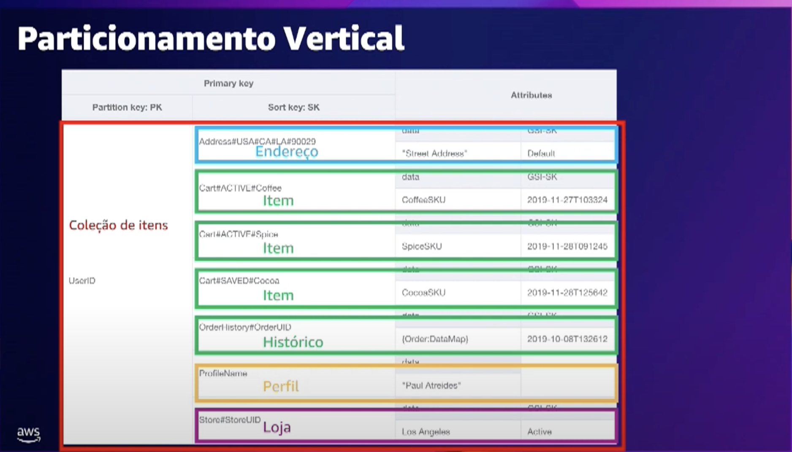

# AWS Dynamo DB

By default, all DynamoDB tables are encrypted under an AWS owned customer master key (CMK), which do not write to CloudTrail logs.

All DynamoDB tables are encrypted. There is no option to enable or disable encryption for new or existing tables. By default, all tables are encrypted under an AWS owned customer master key (CMK) in the DynamoDB service account. However, you can select an option to encrypt some or all of your tables under a customer-managed CMK or the AWS managed CMK for DynamoDB in your account.

## Vertical Partitions

## Single table design

## References

- Video no youtube explicando modelo de dados e um case da Americanas.com
https://www.youtube.com/watch?v=T-X-kxbU18s