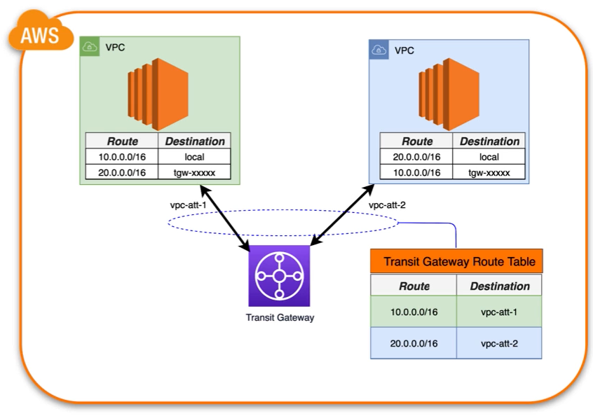

# AWS Transit Gateway

Witch AWS transit gateway its possible interconect one or more VPC and VPN connections.

Given the cenary where you have two VPC and want conect these VPC with transit gateway:

VPC 01:
Name: my-super-vpc-01
CIDR Block: 10.0.0.0/16

|Route|Destination|
|--|--|
|10.0.0.0/16|local|
|20.0.0.0/16|transit-gateway-id|

VPC 02:
Name: my-super-vpc-02
CIDR Block: 20.0.0.0/16
Route table:

|Route|Destination|
|--|--|
|20.0.0.0/16|local|
|10.0.0.0/16|transit-gateway-id|

Transit gateway has its own route table when you have map all VPC ips:

Route Table of transit gateway

|Route|Destination|
|--|--|
|10.0.0.0/16|my-super-vpc-01-attachement|
|10.0.0.0/16|my-super-vpc-02-attachement|

