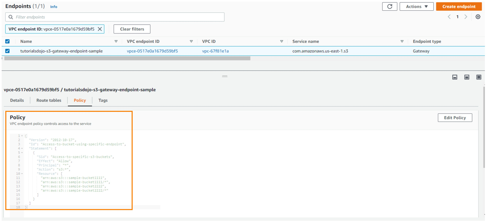

# VPC Endpoints

## Endpoint policy

It's possible create an endpoint policy to an endpoint, similar to S3 Bucket Policy. In image above demonstrate this:

## Gateway endpoints

* S3 
* DynamoDB

## Interface Endpoints
